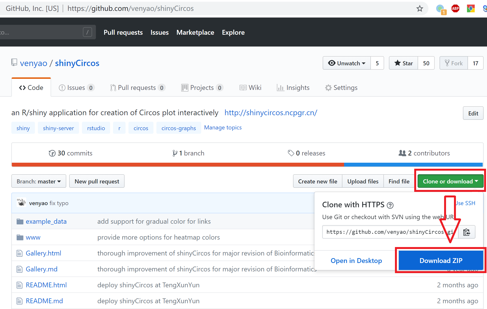

shinyCircos
========

This is the repository for the Shiny application presented in "<a href="https://academic.oup.com/bioinformatics/advance-article-abstract/doi/10.1093/bioinformatics/btx763/4657077" target="_blank">shinyCircos: an R/Shiny application for interactive creation of Circos plot</a>" (Yu et al. ***Bioinformatics***. 2017).

*****

#	<font color="red">Help manual for the usage of shinyCircos [<a target="_blank" href="http://shinycircos.ncpgr.cn/shinyCircos_Help_Manual.pdf">Download!</a>]</font>

*****

#	Use shinyCircos online

shinyCircos is deployed at <a href="http://venyao.xyz/shinyCircos/" target="_blank">http://venyao.xyz/shinyCircos/</a>, <a href="http://shinycircos.ncpgr.cn/" target="_blank">http://shinycircos.ncpgr.cn/</a> and <a href="https://yimingyu.shinyapps.io/shinycircos/" target="_blank">https://yimingyu.shinyapps.io/shinycircos/</a> for online use.  
shinyCircos is idle until you activate it by accessing the URLs.  
So it may take some time when you access this URL for the first time.   
Once it was activated, shinyCircos could be used smoothly and easily.

*****

#	<font color="red">Launch shinyCircos directly from R and GitHub (preferred approach)</font>

User can choose to run shinyCircos installed locally for a more preferable experience.

**Step 1: Install R and RStudio**

Before running the app you will need to have R and RStudio installed (tested with R 3.3.3 and RStudio 1.0.143).  
Please check CRAN (<a href="https://cran.r-project.org/" target="_blank">https://cran.r-project.org/</a>) for the installation of R.  
Please check <a href="https://www.rstudio.com/" target="_blank">https://www.rstudio.com/</a> for the installation of RStudio.  

**Step 2: Install the R Shiny package and other packages required by shinyCircos**

Start an R session using RStudio and run these lines:  
```
install.packages("shiny")  
install.packages("circlize")  
install.packages("RColorBrewer")
install.packages("data.table")
install.packages("RLumShiny")  
# try http:// if https:// URLs are not supported   
source("https://bioconductor.org/biocLite.R")  
biocLite("GenomicRanges")
```

**Step 3: Start the app**  

Start an R session using RStudio and run these lines:  
```
shiny::runGitHub("shinyCircos", "venyao")  
```
This command will download the code of shinyCircos from GitHub to a temporary directory of your computer and then launch the shinyCircos app in the web browser. Once the web browser was closed, the downloaded code of shinyCircos would be deleted from your computer. Next time when you run this command in RStudio, it will download the source code of shinyCircos from GitHub to a temporary directory again. This process is frustrating since it takes some time to download the code of shinyCircos from GitHub.  

Users are suggested to download the source code of shinyCircos from GitHub to a fixed directory of your computer, such as 'E:\\apps' on Windows. Following the procedure illustrated in the following figure, a zip file named 'shinyCircos-master.zip' would be downloaded to the disk of your computer. Move this file to 'E:\\apps' and unzip this file. Then a directory named 'shinyCircos-master' would be generated in 'E:\\apps'. The scripts 'server.R' and 'ui.R' could be found in 'E:\\apps\\shinyCircos-master'.  
<br>
  
<br>

Then you can start the shinyCircos app by running these lines in RStudio.  
```
library(shiny)
runApp("E:/apps/shinyCircos-master", launch.browser = TRUE)
```

*****

#	Deploy shinyCircos on local or web Linux server

**Step 1: Install R**  

Please check CRAN (<a href="https://cran.r-project.org/" target="_blank">https://cran.r-project.org/</a>) for the installation of R.

**Step 2: Install the R Shiny package and other packages required by shinyCircos**  

Start an R session and run these lines in R:  
```
install.packages("shiny")  
install.packages("circlize")  
install.packages("RColorBrewer")
install.packages("data.table")
install.packages("RLumShiny")  
## try http:// if https:// URLs are not supported  
source("https://bioconductor.org/biocLite.R")  
biocLite("GenomicRanges")  
```

For more information, please check the following pages:  
<a href="https://cran.r-project.org/web/packages/shiny/index.html" target="_blank">https://cran.r-project.org/web/packages/shiny/index.html</a>  
<a href="https://github.com/rstudio/shiny" target="_blank">https://github.com/rstudio/shiny</a>  
<a href="https://shiny.rstudio.com/" target="_blank">https://shiny.rstudio.com/</a>  

**Step 3: Install Shiny-Server**

Please check the following pages for the installation of shiny-server.  
<a href="https://www.rstudio.com/products/shiny/download-server/" target="_blank">https://www.rstudio.com/products/shiny/download-server/</a>  
<a href="https://github.com/rstudio/shiny-server/wiki/Building-Shiny-Server-from-Source" target="_blank">https://github.com/rstudio/shiny-server/wiki/Building-Shiny-Server-from-Source</a>  

**Step 4: Upload files of shinyCircos**

Put the directory containing the code and data of shinyCircos to /srv/shiny-server.  

**Step 5: Configure shiny server (/etc/shiny-server/shiny-server.conf)**

```
# Define the user to spawn R Shiny processes
run_as shiny;

# Define a top-level server which will listen on a port
server {  
  # Use port 3838  
  listen 3838;  
  # Define the location available at the base URL  
  location /shinycircos {  
    # Directory containing the code and data of shinyCircos  
    app_dir /srv/shiny-server/shinyCircos;  
    # Directory to store the log files  
    log_dir /var/log/shiny-server;  
  }  
}  
```

**Step 6: Change the owner of the shinyCircos directory**

```
$ chown -R shiny /srv/shiny-server/shinyCircos  
```

**Step 7: Start Shiny-Server**

```
$ start shiny-server  
```

Now, the shinyCircos app is available at <a href="http://IPAddressOfTheServer:3838/shinycircos/" target="_blank">http://IPAddressOfTheServer:3838/shinycircos/</a>.  


